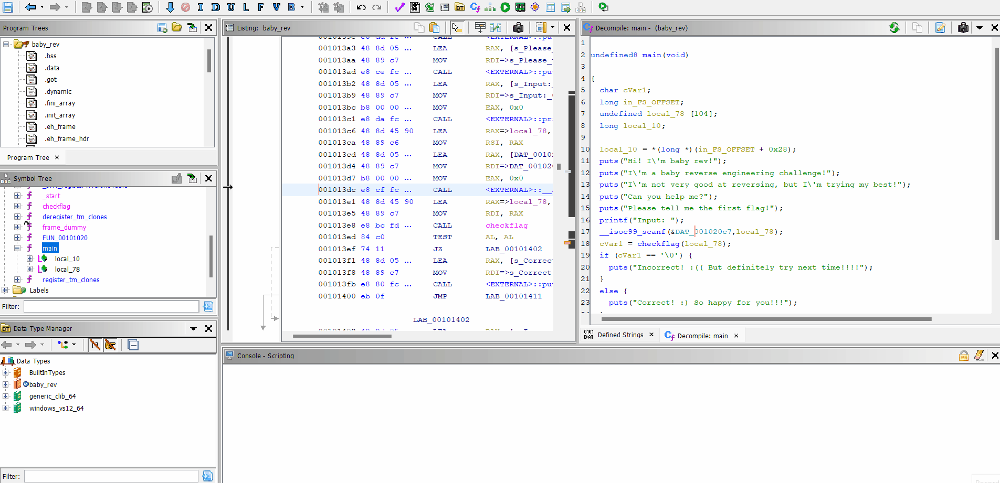

# GptHidra

GptHidra is a Ghidra plugin that uses the [OpenAI Chat GPT](https://chat.openai.com/chat) to explain functions. With GptHidra, you can easily understand the purpose and behavior of functions in your codebase.

## What's New

**GPT-4 Integration**: Benefit from the latest advancements in natural language processing, providing even more insightful and accurate code explanations.

[Learn more about accessing to GPT-4](https://help.openai.com/en/articles/7102672-how-can-i-access-gpt-4).

## Requirements

- Ghidra `>= 10.1.5` (https://ghidra-sre.org).
- An API key for the OpenAI Chat GPT API (https://beta.openai.com/account/api-keys).

## Installation

1. Download the GptHidra script [GptHidra.py](./GptHidra.py).
2. Open the Ghidra Script Manager (found in the `Tools` menu).
3. Click the `New` button to create a new script.
4. Select `Python` as the language and give the script the name `GptHidra.py`.
5. Paste the contents of the [GptHidra.py](./GptHidra.py) script into the editor window.
6. Replace `API_KEY = ''` with your [OpenAI Chat GPT API key](https://beta.openai.com/account/api-keys).
7. Click the `Save` button to save the script.

## Usage

To use GptHidra, select a function in the Ghidra decompiler and do one of the following:

1. Press `Ctrl + Alt + G` (you can edit the script to change this shortcut).

2. Go to `Tools -> GptHidra` (you can edit the script to change this menu item).

An explanation of the selected function will be printed to the Ghidra console.

## Contact

Telegram: [@evyatar9](https://t.me/evyatar9)

Discord: [evyatar9](https://discord.com/users/812805349815091251)

## Contributing

If you would like to contribute to the GptHidra extension, feel free to submit a pull request or report any issues you encounter on the [GptHidra repository](https://github.com/evyatar9/GptHidra).

## References

[https://ghidra.re/ghidra_docs/api/ghidra/app/decompiler/DecompInterface.html](https://ghidra.re/ghidra_docs/api/ghidra/app/decompiler/DecompInterface.html)

[https://beta.openai.com/docs/](https://beta.openai.com/docs/)

## Support
You can support my work buying me a coffee:

## Stargazers over time

