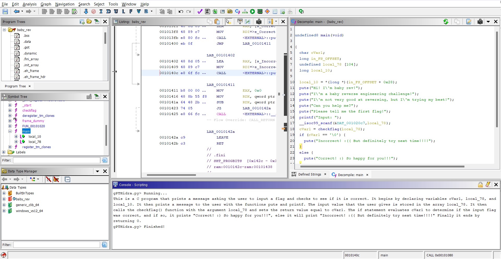
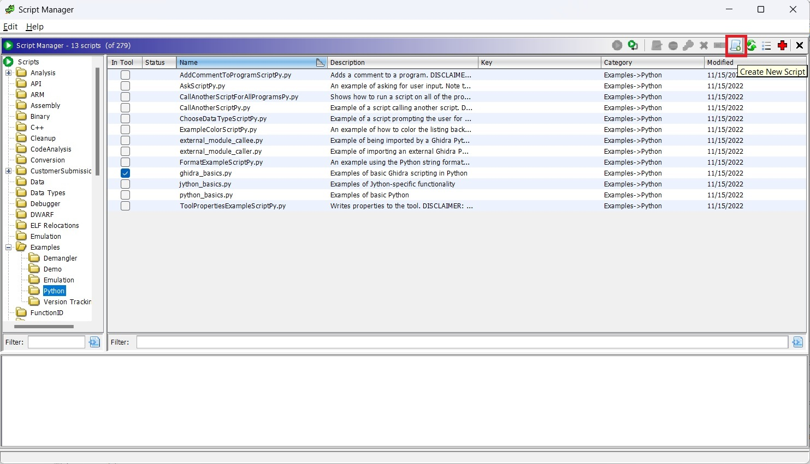
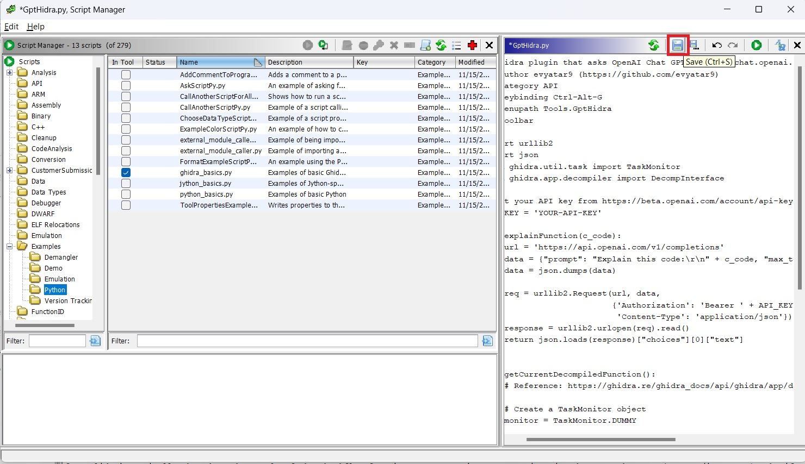
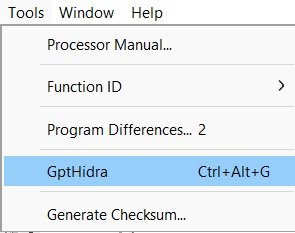

# GptHidra

Ghidra plugin that asks [OpenAI Chat GPT](https://chat.openai.com/chat) to explain functions! :)



## Requirements

1. [API_KEY](https://beta.openai.com/account/api-keys) to use Open AI API

2. The following are needed to use this plugin:

Tool | Version |Source |
|---|---|---|
| Ghidra | `>= 10.2` | https://ghidra-sre.org |

Note: ```Ghidra >= 10.2``` requires [JDK 17 64-bit](https://adoptium.net/temurin/releases/).

## Install

Open ```Ghidra Script Manager``` and create a new script:



Choose ```python```, Set the name ```GptHidra.py``` , Paste the content of [GptHidra.py](./GptHidra.py), Set your ```API_KEY``` and save it:
```python
# Ghidra plugin that asks OpenAI Chat GPT (https://chat.openai.com/chat) to explain functions! :)
# @author evyatar9 (https://github.com/evyatar9)
# @category API
# @keybinding Ctrl-Alt-G
# @menupath Tools.GptHidra
# @toolbar

import urllib2
import json
from ghidra.util.task import TaskMonitor
from ghidra.app.decompiler import DecompInterface

# Get your API key from https://beta.openai.com/account/api-keys
API_KEY = ''

def explainFunction(c_code):
    url = 'https://api.openai.com/v1/completions'
    data = {"prompt": "Explain this code:\r\n" + c_code, "max_tokens": 2048, "model": "text-davinci-003"}
    data = json.dumps(data)

    req = urllib2.Request(url, data,
                          {'Authorization': 'Bearer ' + API_KEY,
                           'Content-Type': 'application/json'})
    response = urllib2.urlopen(req).read()
    return json.loads(response)["choices"][0]["text"]


def getCurrentDecompiledFunction():
    # Reference: https://ghidra.re/ghidra_docs/api/ghidra/app/decompiler/DecompInterface.html

    # Create a TaskMonitor object
    monitor = TaskMonitor.DUMMY

    # Create a DecompInterface object
    decompiler = DecompInterface()

    # Set the current program for the decompiler
    decompiler.openProgram(currentProgram)

    # Get the current address and the function containing it
    currentAddress = currentLocation.getAddress()
    functionName = getFunctionContaining(currentAddress)

    # Decompile the function and get the resulting C code
    return decompiler.decompileFunction(functionName, 30, monitor).getDecompiledFunction().getC()

try:
    c_code = getCurrentDecompiledFunction()
    print(explainFunction(c_code))
except Exception as e:
    print(e)
```



## How to use it?

### Option 1

1. Select the function
2. Ctrl + Alt + G (You can edit the script to change it)

### Option 2

1. Select the function
2. Tools -> GptHidra (You can edit the script to change it)



Example:


## References

[https://ghidra.re/ghidra_docs/api/ghidra/app/decompiler/DecompInterface.html](https://ghidra.re/ghidra_docs/api/ghidra/app/decompiler/DecompInterface.html)

[https://beta.openai.com/docs/](https://beta.openai.com/docs/)


## Contact

Telegram: [@evyatar9](https://t.me/evyatar9)

Discord: [evyatar9#5800](https://discordapp.com/users/812805349815091251)